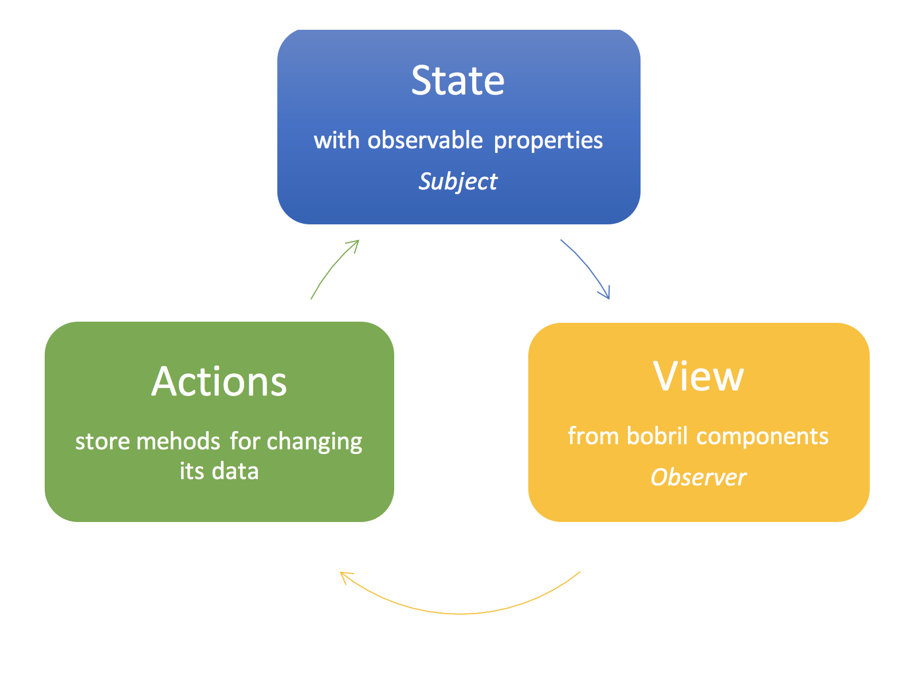

# BobX Application Store Management

**[Download sample](https://minhaskamal.github.io/DownGit/#/home?url=https://github.com/keeema/bobril-samples/tree/master/sampleBobX)**

### Introduction

In the [second article](http://www.codeproject.com/Articles/1055921/Bobril-II-Bobflux-application-architecture), we have created a simple ToDo application using bobflux framework. In this article, we will learn how to create such application in an easier way using the new framework [BobX](https://github.com/bobril/bobx).

- [Bobril - I - Getting Started](http://www.codeproject.com/Articles/1044425/Bobril-I-Getting-started)
- [Bobril - II - Bobflux Application Architecture](http://www.codeproject.com/Articles/1055921/Bobril-II-Bobflux-application-architecture)
- [Bobril - III - Localizations and Formatting](http://www.codeproject.com/Articles/1058132/Bobril-III-Localizations-and-formatting)
- [Bobril - IV - Routing](http://www.codeproject.com/Articles/1058609/Bobril-IV-Routing)
- [Bobril - V - Bobril-build](https://www.codeproject.com/Articles/1167901/bobril-build)
- [Bobril - VI - BobX Application Store Management](https://www.codeproject.com/Articles/1201171/Bobril-VI-BobX-Application-Store-Management)

### Background

BobX is MobX like library for managing application stores created by Boris Letocha (Quadient). It is written in TypeScript and fits the bobril application needs. It uses the observer pattern where stores are observable subjects and bobril components are observers.


### Let's Start

We will create a simple TODO application again. At first, we need to have prepared _bobril-build_ on computer. Follow the steps in the [first article](http://www.codeproject.com/Articles/1044425/Bobril-I-Getting-started) to perform bobril-build installation.

Now you can start a new project again or use a predefined skeleton simpleApp from [bobril-build github repository](https://minhaskamal.github.io/DownGit/#/home?url=https://github.com/Bobris/bobril-build/tree/master/examples/simpleApp).

The following example will use it. To get final code including all needed components, [download the full sample](https://minhaskamal.github.io/DownGit/#/home?url=https://github.com/keeema/bobril-samples/tree/master/sampleBobX).

BobX uses the experimental feature of TypeScript - decorators. To allow the usage of decorators, add the following parameter to the _bobril/compilerOptions_ section in _package.json_:
```
"bobril": {
    "compilerOptions": {
        "experimentalDecorators": true
    }
}
```
### Add BobX to Application

Run the following commands in the root of application folder:
``` bash
npm i
npm i bobx --save
bb
```
### Store

At first, we will create a simple bobx store containing the same data as the bobflux variant. This store will be in file _store.ts:_
``` javascript
import { observable } from 'bobx';

class TodoStore {
    @observable todoName: string = '';
    @observable private _todos: string[] = [];

    get todos(): string[] {
        returnthis._todos;
    }

    addTodo(): void {
        if (this.todoName.trim().length === 0)
            return;
        this._todos.push(this.todoName.trim());
        this.todoName = '';
    }
}

export const todoStore = new TodoStore();
```
In the code above, you can see used an @observable decorator on fields todoName and _todos. This decorator creates getters/setters with the tracking functionality on these fields. It will cause tracking of these fields. When such field is used in any rendering function in node of bobril component, then function b.invalidate(ctx) will be called automatically with particular context on every change of this field.

### Composing the Page with BobX

Now, we have everything prepared to be used on the page of the todo application. The _src/mainPage.ts_ will look like this:
``` javascript
import * as b from 'bobril';
import { button } from './components/button';
import { textbox } from './components/textbox';
import { p } from './components/paragraph';
import { h1 } from './components/header';
import { todoStore } from './store';

export const mainPage = b.createComponent({
    render(_ctx: b.IBobrilCtx, me: b.IBobrilNode): void {
        me.children = [
            h1({}, 'TODO'),
            p({}, [
                textbox({ 
                    value: todoStore.todoName, 
                    onChange: newValue => todoStore.todoName = newValue 
                }),
                button({ 
                    title: 'ADD', 
                    onClick: () => todoStore.addTodo()
                })
            ]),
            todoStore.todos.map(item => p({}, item)),
            p({}, `Count: ${todoStore.todos.length}`)
        ];
    }
});
```
The components definition is not the subject of this article, so you can use definitions in the attached source code.

You can see that a page imports the store directly from store module.

The textbox and button components use the actions defined on store in their onChange and onClick callbacks so the user interactions from view initiate the action calls. And finally, in the end of the render function is a mapped array of todos to 'p' tags with todo names.

Now, we are able to open the application in a browser on [http://localhost:8080](http://localhost:8080/) and see how it works.

The _Global store_ is one, but not the only one way how to define and use stores.  
The _Page store_ can be instantiated directly in the init method of component and given to its sub-components through data.  
The _Context store_ can be created as the component context for the component's inner data which you want to track.

Example of _Context store_:
``` javascript
class CtxStore extends b.BobrilCtx<IData>; {
    @observable someProperty: string = '';

    constructor(data: IData, me: b.IBobrilCacheNode) {
        super(data, me);
        ...
    }
}

export const myComponent = b.createComponent<IData>;({
    ctxClass: CtxStore,
    render(ctx: CtxStore) {
        ...
    }
})
```
### Store Optimalizations

There is not only the pure observable function to define observable properties. Sometimes, you don’t want to track all properties of objects so let’s take a look at other possible ways:

- observable.deep - The default observable way. It decorates all defined properties of given objects to be observable (tracked) recursively. The recursion stops when the property contains an object with defined prototype.
- observable.ref - Only the reference of object is tracked. No change of inner properties will trigger rendering.
- observable.shallow - This variant will track the reference of given object, its properties but nothing more. So for example, the array will be tracked for its reference, its content, but not for the content of its items.
- observable.map - You can use this function to create a dynamic keyed observable map.
- computed - You can use this decorator on any getter of a class property to declaratively created computed properties. Computed values are values that can be derived from the existing store or other computed values.

To get more information, see the project github pages:

- [https://github.com/bobril/bobx](https://github.com/bobril/bobx)

or MobX documentation pages:

- [https://mobx.js.org](https://mobx.js.org/)